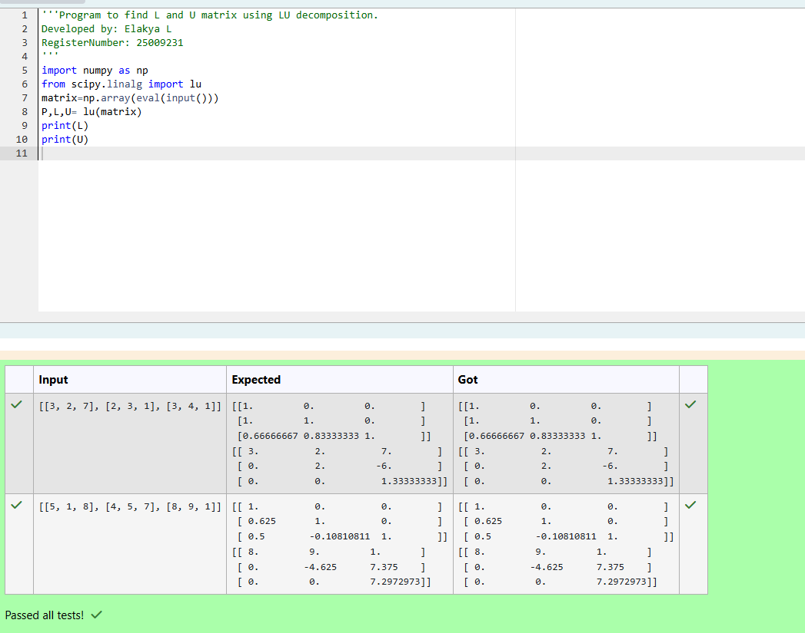
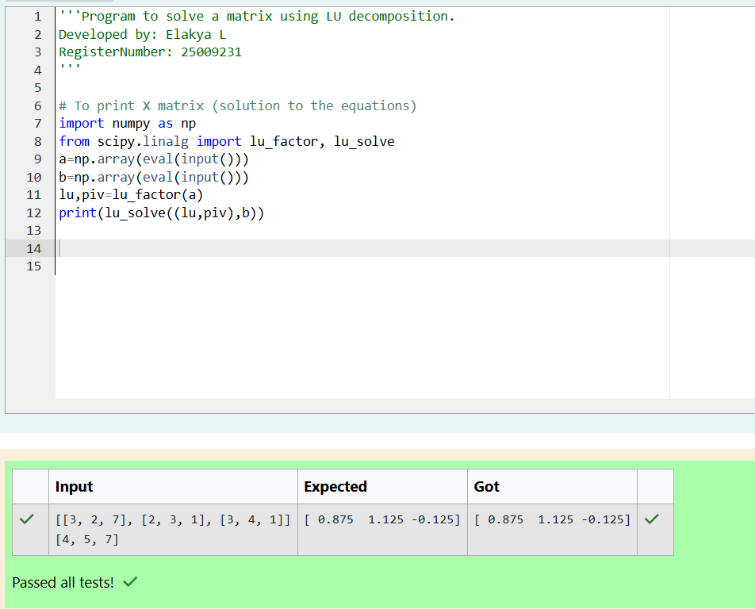

# LU Decomposition 

## AIM:
To write a program to find the LU Decomposition of a matrix.

## Equipments Required:
1. Hardware – PCs
2. Anaconda – Python 3.7 Installation / Moodle-Code Runner

## Algorithm
1. step1: import numpy and scipy module to use the built-in fuctions for calculations 
2. step2: prepare the list for each linear equation and assign it in np.array()
3. step3: Using the lu, lu_factor and lu_solve compute the necessary solutions 
4. step4: end the program 

## Program:
(i) To find the L and U matrix
```
/*
Program to find the L and U matrix.
Developed by: Elakya L
RegisterNumber: 212225230066
*/
import numpy as np
from scipy.linalg import lu 
matrix=np.array(eval(input()))
P,L,U= lu(matrix)
print(L)
print(U)
```
(ii) To find the LU Decomposition of a matrix
```
/*
Program to find the LU Decomposition of a matrix.
Developed by: Elakya L
RegisterNumber: 212225230066
*/
import numpy as np
from scipy.linalg import lu_factor, lu_solve
a=np.array(eval(input()))
b=np.array(eval(input()))
lu,piv=lu_factor(a)
print(lu_solve((lu,piv),b))
```

## Output:






## Result:
Thus the program to find the LU Decomposition of a matrix is written and verified using python programming.

